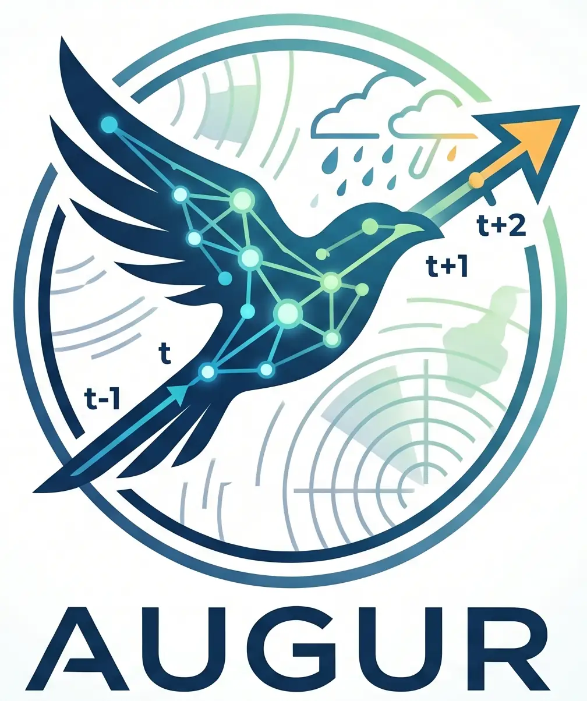

<p align="center">
  
</p>

# Augur

Augur is an internal research codebase for comparing deep learning models on precipitation nowcasting. It collects model implementations, unified training and evaluation entrypoints, metric utilities, and case-study visualization scripts around a common SEVIR-style 6-frame-in, 6-frame-out benchmark.

The repository is designed for rapid experiment iteration rather than packaging. The main training script is intentionally an editable Python file: change the run constants, then execute it directly.

## Highlights

- Unified training entrypoint in [`train.py`][train-py].
- Trainable model registry in [`training/model_config.py`][model-config].
- Dataset builder registry in [`training/data_config.py`][data-config].
- Shared model initialization parameters in [`utils/model_params.py`][model-params].
- Evaluation-time strategy registry in [`utils/model_factory.py`][model-factory].
- Vendored model implementations under [`models/`][models-dir].
- Metric and skill-score utilities for nowcasting evaluation in [`utils/metrics.py`][metrics].
- Case-study scripts and artifacts under [`visualization/`][visualization-dir].

## Repository layout

```text
Augur/
├── train.py                 # Editable training experiment entrypoint
├── eval.py                  # Multi-model evaluation entrypoint
├── models/                  # Vendored model implementations
├── training/                # Training model/data registries
├── utils/                   # Shared metrics, model factory, params, helpers
├── visualization/           # Case-study selection and visualization tooling
├── tests/                   # Lightweight registry/config tests
├── docs/                    # Static assets
└── env.yml                  # Machine-exported conda environment reference
```

## Model coverage

Augur currently vendors and wires the following nowcasting and spatiotemporal prediction models:

| Model | Publication | Notes |
| --- | --- | --- |
| UNet | [MICCAI\`15][unet-paper] | Encoder-decoder CNN with skip connections; used here as a dense-prediction baseline for radar frames. |
| DGMR | [Nature\`21][dgmr-paper] | Deep generative radar model with adversarial training and stochastic samples for sharp, probabilistic precipitation nowcasts. |
| NowcastNet | [Nature\`23][nowcastnet-paper] | Combines physical evolution modeling with conditional generative refinement for skillful extreme-precipitation nowcasting. |
| FourCastNet | [ICLR\`22][fourcastnet-paper] | Adaptive Fourier Neural Operator model that mixes tokens in the spectral domain for fast high-resolution weather forecasting. |
| exPreCast | [ICLR\`26][exprecast-paper] | Deterministic extreme-precipitation model with local spatiotemporal attention, cubic dual upsampling, and flexible temporal extraction. |
| PhyDNet | [CVPR\`20][phydnet-paper] | Two-branch recurrent model that disentangles PDE-like physical dynamics from residual appearance factors in latent space. |
| MAU | [NeurIPS\`21][mau-paper] | Motion-aware recurrent unit that expands temporal receptive fields through attention over historical states and motion fusion. |
| SimVP | [CVPR\`22][simvp-paper] | Simple CNN-only video prediction architecture with encoder, translator, and decoder blocks; a strong low-complexity baseline. |
| ConvLSTM | [NeurIPS\`15][convlstm-paper] | Extends LSTM with convolutional input-to-state and state-to-state transitions for spatiotemporal sequence forecasting. |
| EarthFarseer | [AAAI\`24][earthfarseer-paper] | Local-global architecture pairing parallel convolutions with Fourier-based transformer blocks and multi-scale temporal modeling. |
| AlphaPre | [CVPR\`25][alphapre-paper] | Amplitude-phase disentanglement model that separates intensity structure and phase dynamics for precipitation nowcasting. |
| WADEPre | [arXiv\`26][wadepre-paper] | Wavelet-domain decomposition model with approximation/detail branches and a refiner for multi-scale extreme-rainfall fidelity. |

## Training workflow

Edit [`train.py`][train-py] for the current run:

```python
MODEL_NAME = "UNet"
DATASET_NAME = "hdf5"
BATCH_SIZE = 100
NUM_WORKERS = 128
MAX_EPOCHS = 300
DEVICES = [0, 1]
PRECISION = MODEL_CONFIG.precision
```

Then run:

```bash
python train.py
```

The script directly constructs the model, datamodule, callbacks, CSV logger, DDP strategy, and Lightning trainer. This is deliberate: runtime experiment choices stay visible in one file, while fixed model and dataset defaults stay in the registry modules.

## Evaluation workflow

[`eval.py`][eval-py] evaluates the checkpoint paths listed in `CHECKPOINTS` with metrics over lead times from 10 to 60 minutes. The evaluation adapter is [`utils/model_factory.py`][model-factory], where each `ModelStrategy` handles model-specific checkpoint loading, preprocessing, forward calls, and output normalization.

```bash
python eval.py
```

By convention, model outputs are normalized to `(B, T_out, H, W)` for metric computation.

## Data and environment notes

This checkout expects an external `dataset` package at runtime. In particular, training and evaluation import:

- `dataset.DataReader.HDF5DataModule`
- `dataset.SEVIR.SEVIRLightningDataModule`

Those modules are not fully provided by the committed repository. Make sure the package is available through your environment, symlink, or `PYTHONPATH` before running training or evaluation.

The default data paths are research-machine paths:

- `/data2/StormWave/SEVIR`
- `/data3/SEVIR`

The root [`env.yml`][env-yml] is a useful dependency reference, but it was exported from one machine and contains non-portable path information. Treat it as a starting point, not a guaranteed reproducible environment file.

## Validation

For lightweight local checks, use the available `metnet3` conda environment:

```bash
conda run -n metnet3 python -m compileall -q "train.py" "training" "utils" "models" "tests"
conda run -n metnet3 python -m unittest discover tests
```

These checks validate syntax and registry behavior without requiring GPU access or the external dataset package.

## Development style

The codebase favors explicit research workflow over framework-heavy abstractions:

- Keep runtime experiment choices in `train.py`.
- Keep fixed model construction parameters in `utils/model_params.py` and `training/model_config.py`.
- Keep fixed dataset parameters in `training/data_config.py`.
- Use package-qualified imports such as `models.UNet.UNet`; avoid `sys.path` hacks.
- Use underscore metric names such as `val_loss`, not slash names such as `val/loss`, to keep checkpoint filenames and CSV headers safe.

See [`AGENTS.md`][agents-md] for compact agent-facing repository guidance.

[agents-md]: ./AGENTS.md
[alphapre-paper]: https://openaccess.thecvf.com/content/CVPR2025/papers/Lin_AlphaPre_Amplitude-Phase_Disentanglement_Model_for_Precipitation_Nowcasting_CVPR_2025_paper.pdf
[convlstm-paper]: https://proceedings.neurips.cc/paper_files/paper/2015/file/07563a3fe3bbe7e3ba84431ad9d055af-Paper.pdf
[data-config]: ./training/data_config.py
[dgmr-paper]: https://www.nature.com/articles/s41586-021-03854-z.pdf
[earthfarseer-paper]: https://ojs.aaai.org/index.php/AAAI/article/download/29521/30866
[env-yml]: ./env.yml
[eval-py]: ./eval.py
[exprecast-paper]: https://openreview.net/pdf?id=fDknsQhSgm
[fourcastnet-paper]: https://ai4earthscience.github.io/iclr-2022-workshop/camera_ready/iclr_2022_ai4ess_25.pdf
[mau-paper]: https://proceedings.neurips.cc/paper_files/paper/2021/file/e25cfa90f04351958216f97e3efdabe9-Paper.pdf
[metrics]: ./utils/metrics.py
[model-config]: ./training/model_config.py
[model-factory]: ./utils/model_factory.py
[model-params]: ./utils/model_params.py
[models-dir]: ./models/
[nowcastnet-paper]: https://www.nature.com/articles/s41586-023-06184-4.pdf
[phydnet-paper]: https://openaccess.thecvf.com/content_CVPR_2020/papers/Le_Guen_Disentangling_Physical_Dynamics_From_Unknown_Factors_for_Unsupervised_Video_Prediction_CVPR_2020_paper.pdf
[simvp-paper]: https://openaccess.thecvf.com/content/CVPR2022/papers/Gao_SimVP_Simpler_Yet_Better_Video_Prediction_CVPR_2022_paper.pdf
[train-py]: ./train.py
[unet-paper]: https://arxiv.org/pdf/1505.04597
[visualization-dir]: ./visualization/
[wadepre-paper]: https://arxiv.org/pdf/2602.02096
